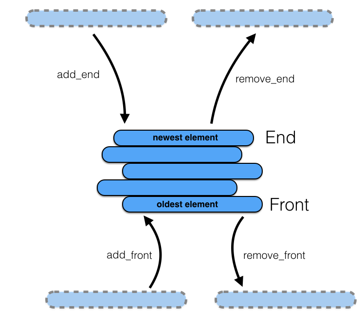
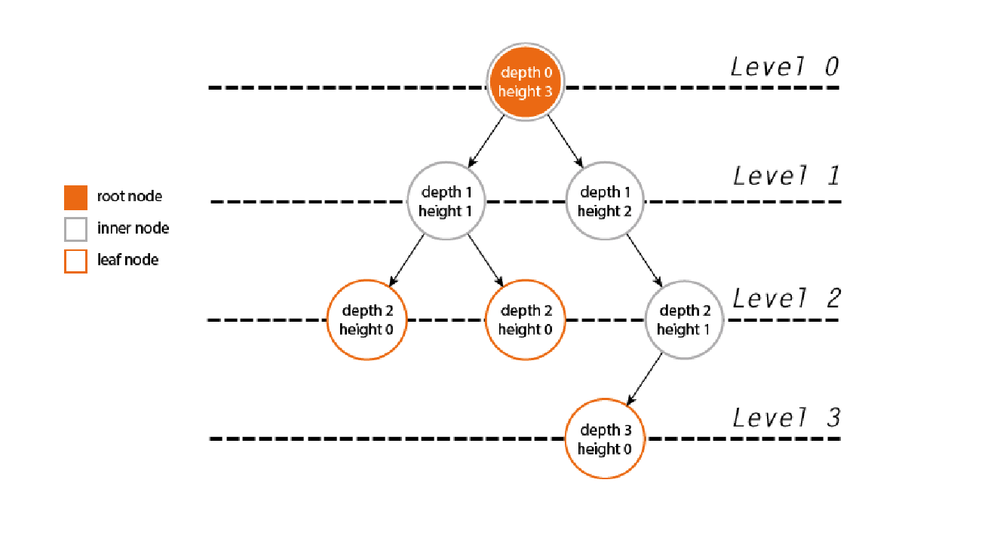

# Abstract Data Types (ADTs)

> Abstract data types (ADTs) refer to classes of objects whose operations and properties are formally defined, but are not restricted to specific implementations.

This is a repository of ADTs written in Ruby and, more recently, Python
(CPython). It is an exercise in implementing an ADT with different data structures and a guide for practical application in the future.

It is not intended to cover all the API variations and implementations for a particular abstract data type.

I define the following ADTs, including their specifications, common operations in their API, and possible implementations with comparisons. I also link my code at the bottom of each section.

Note that many of the ADTs have their own nomenclature, so the same methods may have various names across the data types.

- [Set](#set)
- [Map](#map)
- [Linked List](#linked-list)
  - [Singly-Linked List](#1-singly-linked-list)
  - [Doubly-Linked List](#2-doubly-linked-list)
  - [Circularly-Linked List](#3-circularly-linked-list)
- [Stack](#stack)
  - [Monotonic Stack](#monotonic-stack)
- [Queue](#queue)
  - [Deque](#deque)
  - [Priority Queue](#priority-queue)
  - [Circular Queue](#circular-queue)
- [Tree](#tree)
  - [Binary Tree](#binary-tree)
    - [Binary Search Tree](#1-binary-search-tree)
      - [AVL tree](#1a-avl-tree)
      - [Red Black Tree](#1b-red-black-tree)
    - [Trie](#2-trie)
    - [Radix Tree](#3-radix-tree)
      - [Crit-bit Tree](#3a-crit-bit-tree)
  - [Ternary Tree](#ternary-tree)
  - [Unary Tree](#unary-tree)
[N-ary Tree (Poly Tree)](#n-ary-tree-poly-tree)
- [Graph](#graph)

## Set

> A **Set** is an unordered collection of unique elements.

### Specifications

- Unordered (no promises regarding insertion order)
- Unique collection of elements (no duplicates)
- Immutable elements: Although not a strict requirement, it is generally a good practice to use immutable elements in a set to ensure the integrity of the set's structure.

### API

Basic operations

- `insert(el)`: inserts a new element
- `include?(el)`: queries for an element
- `delete(el)`: removes an element
- `size()`: Returns the number of elements in the set.

Set operations

- `union(set)`: Returns a new set containing all elements from the original set and the input set, without duplicates.
- `intersection(set)`: Returns a new set containing the elements present in both the original set and the input set.
- `difference(set)`: Returns a new set containing the elements present in the original set but not in the input set.
- `subset(set)`: Checks if the original set is a subset of the input set, meaning all elements of the original set are also present in the input set.

### Implementations

1. [Hash Set](#hash-set)

#### Hash Set

- Data is not contiguously stored
- Store elements in sub-arrays (buckets) in an array: when we insert an element into the set, use the modulo operator to deterministically assign every element to a bucket: `index = hash(value) % num_buckets`
  - Elements are required to be hashable
  - Hashing the element's value returns an integer that is a valid index, allowing the set to handle keys of any data type that can be hashed.
  - e.g., { 2, 4, 8, 16, “hello”, “dolly” }
- Don't allow it to be indexed into
  - Use the same **hashing function** to compute an index into it.
- Array should be dynamic: resize the array by a constant multiple that scales with the number of buckets. The goal is to have `buckets.length > N` at all times.
  - This ensures that as our sample size increases, we don't rely more and more on a linear scan to find elements

> Note: in Ruby and Python, Sets are implemented as a hash table
>

##### Time and Space Complexity

Method    | Amortized   | Worst case  | Notes
---       | ---         |  ---        | ---
`include?`| `O(1)`      |   `O(n)`      |
`insert`  | `O(1)`      |   `O(n)`      | Worst case is in rare case of a hash collision
`delete`  | `O(1)`      |   `O(n)`      | Worst case is in rare case of a hash collision

|   SPACE | `O(n)`    |
|---------|-----------|

##### Analysis

- Ruby handles a hash collision with **separate chaining**.
- Python handles a hash collision with **open addressing**.

- The maximum `density` (# of items chained at a location in memory) Ruby allows before `rehashing` is 5, which is `O(n)` time complexity.

- A Hash Set is the fastest implementation of a Set: the hash uses a hashing function to store elements in memory and to later access where they are stored.
  - This creates the highest chance of uniform distribution because there is no pattern to the output, although there is still the chance of a hash collision.
  - We want to use a Hash Set over an array-based set most of the time.
  - Useful if you want to ensure absolutely no duplicates - Hash Maps can have duplicate values (but not keys).
- **Although it isn’t particularly compact (requires pre-allocation of memory), it provides near constant time insertion and removal in the average case.**

### Usefulness

- Sets are most commonly used for:
    1. Membership testing
    2. Eliminating duplicate entries (cleanup)
- **Not ideal for runtime operations**: unfortunately, the edge cases of Hash Set (and Hash Table - up next) performance are significant, the cases are inevitable, and the methods for dealing with them require some runtime tuning.
  - They are comprised of pre-allocated buckets of fixed size, and due to speed requirements of typical non-cryptographic hash functions, collisions are inevitable.
  - <details><summary><strong>There are a number of different ways of handling collisions</strong></summary>
      <ol>
        <li><strong>Chaining</strong>: In this case, collisions are resolved by using a second data structure (such as a <strong>linked list</strong>) to compare elements when a collision is found.
          <ul>
            <li>This method “degrades gracefully,” but requires a good idea of the bucket size to do so.</li>
          </ul>
          </li>
          <li><strong>Open addressing</strong>: Entries are all stored within the hash buckets, and when a collision is found, some probing algorithm is used to find the next free bucket. When free slots run low, the buckets are resized.</li>
          <li><strong>Cuckoo hashing</strong>: Multiple hash functions are used to insert into different places in the bucket. If all hash functions collide, the bucket is resized.
            <ul>
              <li>Might give us better general performance than linear probing on a busy / full table</li>
          </ul>
          </li>
          <li>Several other methods also exist.</li>
        </ol>
    </details>
  - When the buckets require resizing, every element stored in the bucket
   must be re-hashed to find its new place. With millions of keys, this resize operation becomes prohibitively expensive. **(We basically have to double the table size when we run out of space)**.
  - **The fundamental problem with these methods is that they require some level of runtime tuning.**
    - For ex., for the [Fastly CDN](https://www.fastly.com/blog/surrogate-keys-part-2), the time required to complete this operation could cause it to pause for a significant time period — significant enough to cause it to appear to “miss” purge requests for surrogate keys.

### Code References

> **Ruby**
>
> - [Set - hash implementation](ruby/set/hash_set.rb)
>
>**Python**
>
> - [Set implementation](python/set/dynamic_array_set.py)
>

-------------------------------------------------

## Map

> At its essence, a **Map** is just an unordered collection of key-value pairs.

### Terminology

- Also called a **Dictionary** and **Associative Array**
- **Hash Table**: conceptually the same as a **Hash Map**, though not in practice - Java has both `HashMap` and `Hashtable` classes with different underlying implementations / use cases due to historical reasons (`HashMap` is newer).
  - It is a **data strucure** that implements a Map. It allows for the efficient storage and retrieval of values based on associated keys.
  - A hash table uses a **hash function** to compute an index, also called a **hash code**, into an array of buckets or slots, from which the desired value can be found.
  - From the client code's perspective, elements are accessed using a key rather than an index number.

### Specifications

- Unordered (no promises regarding insertion order)
- Duplicate values are allowed, but not duplicate keys

### API

- `get(k)`: queries for a key-value pair and returns the value
- `set(k, v)`: creates a new key-value pair or updates the value for a pre-existing key
- `delete(k)`: deletes a key-value pair

### Implementations

The underlying implementations below are similar to the ones for the Set. The main difference is that the Map implementations allow for duplicate values (but not keys) and the Set implementations do not.

1. [2D array-based Map](#2d-array-based-map)
2. [Hash Map](#hash-map)

#### 2D array-based Map

- Also called a `touple`.
- The array will contain several subarrays, and each subarray will contain a k,v pair.

##### Time and Space Complexity

Method    | Avg. Case | Worst Case | Best Case   | Notes
---       | --- | ---         |  ---        | ---
`get`     |   `O(n)` | `O(n)`      |  `O(1)`       |
`set`     |   `O(n)` | `O(n)`      |  `O(1)`       |
`delete`  |  `O(n)` |  `O(n)`      |  `O(1)`       |

  |   SPACE | `O(n)`    |
  |---------|-----------|

- Note: the time and space complexities are the same as for the array-based set.

---

#### Hash Map

- For the Hash Map implementation, the internals will basically be the same, but we will use a Doubly Linked List for our buckets instead of sub-arrays so that we can use link objects that store both a key and a value in one node together.
  - We could also just use touples, but the Linked List is the classic, canonical way to implement a Hash Map.
- A hash table is a form of list where elements are accessed by a keyword rather than an index number. At least, this is how the client code will see it.
  Internally, it will use a slightly modified version of our hashing function in order to find the index position in which the element should be inserted.
  This gives us fast lookups, since we are using an index number which corresponds to the hash value of the key.

##### Time and Space Complexity

Method    | Amortized   | Worst Case  | Notes
---       | ---         |  ---        | ---
`get`     | `O(1)`        |   `O(n)`      | Worst case is in rare case of a hash collision
`set`     | `O(1)`        |   `O(n)`      | Worst case is in rare case of a hash collision
`delete`  | `O(1)`        |   `O(n)`      | Worst case is in rare case of a hash collision

  |   SPACE | `O(n)`    |
  |---------|-----------|

- Note: the time and space complexities are the same as for the Hash Set.

### Usefulness

- Useful when you want to store values associated with keys.
- Dictionaries provide constant time (amortized) performance for assignments and accesses, which means they are ideal
   for bookkeeping dynamic information.

### Code References

> **Ruby**
>
> - [Map - hash map implementation](ruby/map/hash_map.rb)
> - [Map - 2D array-based implementation](ruby/map/array_map.rb)
>
>**Python**
>
> - [Map - 2D array-based implementation](python/map/dynamic_array_map.py)
>

-------------------------------------------------

## Linked List

> A **Linked List** is a linear collection of data elements of any type, called nodes, where each node itself has a value, and points to the next node in the list.

**Linked List vs Array**:
> While arrays have contiguously stored data, Linked Lists spread out their data across many cells across the computer's memory.
> These cells are **nodes**. In addition to the data stored within the node, each node also stores the memory address
> of the next node in the Linked List. These pointers are a **link**.
>
> - **Insertion**: Unlike arrays, the insertion of new elements at the beginning of the list is very cheap (`O(1)`), since it only requires us to change one reference or pointer
> - **No random access** and no access to **len** (number of elements in list)
> - **Searching**: for an element is the same as an array (`O(n)`)

### Terminology

- `Head`: first node
- `Tail`: last node
  - Points to `nil` / `None`

### Specifications

- Each node has a value
- Each node has a pointer to the next node in the list
- Sequential/Ordered (i.e. consistent element ordering based on collection population)
- Duplicates permitted
- No indexing (meaning no random access)

### API

- `include?(key)`: returns boolean indicating whether the node is in the List
- `append(key, value)`: appends a node
- `prepend(key, value)`: prepends a node
- `remove(key)`: removes a node
- `empty?`: returns boolean indicating whether the List is empty
- `[](index)`: returns the node at a specified index or nil if the node is not in the List
- `get(key)`: returns the value of the node at a specified index or nil if the node is not in the List
- `update(key, value)`: updates the value for a node and returns that node or nil if the node is not in the List
- `first`: returns the first node
- `last`: returns the last node

### Sub-Types

#### 1) **Singly-Linked List**

#### 2) **Doubly-Linked List**

- Singly-Linked List with augmentations: add a `previous` attribute for the nodes and keep track of the `tail`

### Implementation

- This implementation applies to both Linked List types mentioned above.
- Implemented using a `Node` class.
  - A Linked List is a `node-based data structure`.
    - Trees also fall into this category.
- The time and space complexities below refer to this implementation.
- Note that the time and space complexities for the Singly-Linked List and Doubly-Linked List will be the same asymptotically, so the following complexities are for both types.
- **Time Complexity**

Method | Avg. Case | Worst Case | Best Case | Notes
---    | ---      | ---        | ---       | ---
`include?` | `O(n)` |   `O(n)` |   `O(1)`  |
`append` |   `O(1)` |   `O(1)` |   `O(1)`  | Assuming access to tail
`prepend` | `O(1)`  |   `O(1)` |   `O(1)`  | Assuming access to head
`remove` |  `O(n)`  |   `O(n)` |   `O(1)`  | Deletion is more efficient in a Doubly-Linked List than Singly because we have a previous pointer, so we can easily access the node before the node being deleted to change its next pointer
`empty?` | `O(1)`   |   `O(1)` |   `O(1)`  | Only have to check if the head's next pointer is the tail
`[]`     |  `O(n)`  |   `O(n)` |   `O(1)`  |
`get`    |  `O(n)`  |   `O(n)` |   `O(1)`  |
`update` |  `O(n)`  |   `O(n)` |   `O(1)`  |
`first`  |  `O(1)`  |   `O(1)` |   `O(1)`  |
`last`   |  `O(1)`  |   `O(1)` |   `O(1)`  | Assuming access to tail

- Note: insertion / deletion anywhere other than the beginning or end would only be `O(n)` (assuming you don't have a pointer / reference to the node) because it has to search the LinkedList for that node. But, that's not what we often use the Linked List for. The LinkedList is best for adding and removing elements sequentially.
  - **So insertion and deletion are summarized as `O(1)` assuming the LinkedList is used in its optimal way (e.g., LRU cache)**

- **Space Complexity**: `O(n)`
  - Space complexity for a Doubly-Linked List is more than a Singly-Linked List because were storing an extra link to a node, but it doesn't change it asymptotically (still linear).

#### 3) **Circularly-Linked List**

- **Circular**
  - **Cycle**: when a node points back to a previous node. Begins at the last node of the linked list

### Usage

- The advantage of the Linked List is that the values are stable: they don't correspond to indices, so you never need to re-index.
  - If you are building an `LRU Cache` the Linked List is essential as an auxiliary structure for its quick insertion and deletion time `O(1)`. You never need to index because always delete from the beginning or end. The Hash Map on its own would be slower: `O(n)` because it would have to iterate to find the key with the most recent timestamp value since it is unordered. With an array as the auxiliary structure these operations would still take `O(n)` time because you would be stuck re-indexing.
  - Also, unlike lists, Linked Lists don't preallocate memory
- Useful in general if you are deleting many items: it will be faster than with an array, but doesn't make a difference in the time complexity asymptotically.

### Code References

> **Ruby**
>
> - [Doubly-Linked List - Node class implementation](ruby/linked_list/linked_list.rb)
>
>**Python**
>
> - [Singly, Doubly, and Circular - Node implementation](python/linked_list/linked_list.py)

-------------------------------------------------

## Stack

> A **Stack** stores data in the same way that arrays do - it is simply a list of elements - but stacks have added on constraints.

### Specifications

- LIFO
  - Data can only be inserted at the end of a stack
  - Data can only be removed from the end of a stack
  - Data can only be read from the end of a stack
- Sequential/Ordered (i.e. consistent element ordering based on collection population)
- Duplicates permitted
- Addition and removal of a single item is an `O(1)` algorithm

### API

- `push(el)`: adds an element to the top of the Stack
- `pop`: removes the top element in the Stack and returns it
- `peek`: returns the top element in the Stack
- `empty`: check whether the stack is empty

### Implementations

1\) **Array**

- **Time Complexity**

Method  |  Worst Case | Notes
---     |  ---        | ---
`push`  | `O(1)`      | `Array#push` is `O(1)` time
`pop`   | `O(1)`      | `Array#pop` is `O(1)` time
`peek`  | `O(1)`      | `Array#last` is `O(1)` time
`empty` | `O(1)`      |

- **Space Complexity**: `O(n)`

2\) **Linked List**

- A Stack can be implemented as a Doubly Linked List by just enforcing constraints on it that only allow insertion, removal, and peeking at the tail.
- Initialize and track a `self.size` variable so that `empty()` remains `O(1)`

- **Analysis**:
  - Implementing a Stack with an array or Linked List will have the same space and time complexities asymptotically.

### Usage

- Recursion (stack frame)
- The 'back' button of our web browser.
  - Web browsers, often use two stacks to move backward and forward through your browsing history.
- Syntax checking; matching opening and closing parentheses (e.g., in regex, math equations, compilers etc.) to be specific.
- Backtracking algorithms
- Ideal as a temporary container for temporary data

### Sub-Types

-------------------------------------------------

#### Monotonic Stack

> A **monotonic stack** is a stack whose elements are monotonically increasing or decreasing. It contains all qualities that a typical stack has.

-------------------------------------------------

### Code References

> **Ruby**
>
> - [Stack - array implementation](ruby/stack/array_stack.rb)
>
>**Python**
>
> - [Stack - array and linked list implementation](python/stack/stack.py)
>

-------------------------------------------------

## Queue

> Like a Stack, a **Queue** handles temporary data elegantly and is also essentially an array with restrictions.
>
> - Stacks and Queues can be effectively implemented by dynamic arrays or linked lists. However, unlike for stacks,
>   a simple underlying array won't cut it. The implementation would involve using 2 arrays implemented as stacks
>   (`inbound_stack` and `outbound_stack`)
> - Queues are harder to implement and appropriate when order is important.

### Specifications

- FIFO
  - Data can only be inserted at the end of a Queue (same as Stack)
  - Data can only be read from the front of a Queue (opposite behavior of Stack)
  - Data can only be removed from the front of a Queue (opposite behavior of Stack)
- Sequential/Ordered (i.e. consistent element ordering based on collection population)
- Duplicates permitted
- Unlike a stack, tracking the tail in a queue is not optional

### API

- `enqueue(el)`: adds an element to the back of the Queue
- `dequeue`: removes the element at the front of the Queue and returns it
- `first`: returns the element at the front of the Queue
- `empty`: return true if the Queue does not contain any elements.

### Implementations

1\) **Array**

- Naive implementation
- Note that it is your choice which ends of the array will be the "front" and "back".
  - This will change which array methods you use in your implementation.
- **Time complexity**

Method | Worst Case | Best case | Notes
---    | ---        | ---       |  ---
`enqueue` | `O(1)`    |   `O(1)`    |  `Array#push` has `O(1)` runtime
`dequeue`|  `O(n)`    |   `O(n)`    | `Array#shift` has `O(n)` runtime
`first`|  `O(1)`    |   `O(1)`    |
`empty`|  `O(1)`    |   `O(1)`    |

- **Analysis**
  - Could do better: is there a way to implement a Queue using an array in constant time?
    - Yes, implement it using 2 stacks. (Amortized constant time)
    - See `NaiveArrayQueue` vs `BetterArrayQueue` in the code files linked at the end of this section.
  - Could still do better with Doubly-Linked List.

2\) **Doubly Linked List**

- A Queue can be implemented as a Doubly-Linked List by just enforcing constraints on it that only allow you to add to the back, delete from the front and peek at the first element in the front of the Queue.

Method | Worst Case | Best case | Notes
---    | ---        | ---       |  ---
`enqueue` | `O(1)`    |   `O(1)`    |
`dequeue`|  `O(1)`    |   `O(1)`    |
`first`|  `O(1)`    |   `O(1)`    |
`empty`|  `O(1)`    |   `O(1)`    |

- **Analysis**
  - Doubly-Linked List is the superior implementation - pure constant runtime.

### Usage

- Printing queues
- Handling asynchronous requests - queues ensure that requests are processed in the order in which they are received
- Operating systems use queues to handle requests to write data to a hard disk drive, stream audio and video, and send and receive network packets
- Web servers, on the other hand, use queues to handle incoming requests
  - Whenever you see a “buffering” message, it means the software system you are using is probably waiting for incoming data to add to its queue for processing.
- Internally, a list is represented as an array; the largest costs come from growing beyond the current allocation size (because everything must move), or from inserting or deleting somewhere near the beginning (because everything after that must move). **If you need to add/remove at both ends, consider using a `collections.deque` instead.**
  - A deque (double-ended queue) is represented internally as a doubly linked list. (Well, a list of arrays rather than objects, for greater efficiency.) Both ends are accessible, but even looking at the middle is slow, and adding to or removing from the middle is slower still.

### Code References

> **Ruby**
>
> - [Queue - Naive array, stack array](ruby/queue/array_queue.rb)
>
>**Python**
>
> - [Queue - Naive array, stack array](python/queue/array_queue.py)
> - [Queue - Doubly Linked List](python/queue/doubly_linked_list_queue.py)

### Deque

-------------------------------------------------

> A **Deque** (not to be confused with the "dequeue" operation in queues), or **double-ended queue**, is a data structure that is closely related to queues. Deques allow us to add and remove items at both sides of a queue.
>
> It is usually pronounced “deck” to avoid confusion with the dequeue method of the regular queue ADT, which is pronounced like the abbreviation “D.Q.”



#### API

Method | Worst Case | Best case | Notes
---    | ---        | ---       |  ---
`add_first` | `O(1)`    |   `O(1)`    |
`add_last`|  `O(1)`    |   `O(1)`    |
`delete_first`| `O(1)`    |   `O(1)`    |
`delete_last`| `O(1)`    |   `O(1)`    |
`first`|  `O(1)`    |   `O(1)`    |
`last`|  `O(1)`    |   `O(1)`    |
`empty`|  `O(1)`    |   `O(1)`    |

### Implementation

1\) **Doubly Linked List**

- Builds on the **Doubly Linked List** Queue implementation to add additional methods.

#### Usage

The deque abstract data type is more general than both the stack and the queue ADTs. The extra generality can be useful in some applications. For example, a restaurant using a queue to maintain a waitlist. Occassionally, the first person might be removed from the queue only to find that a table was not available. Typically, the restaurant will re-insert the person at the first position in the queue.

### Code References

>**Python**
>
> - [Queue - Deque](python/queue/deque.py)

-------------------------------------------------

### Priority Queue

-------------------------------------------------

> A priority queue is somewhat similar to a queue, with an important distinction: each item is added to a priority queue with a priority level,
> and will be later removed from the queue with the highest priority element first. That is, the items are (conceptually) stored in the queue
> in priority order instead of in insertion order.

#### Specifications

- Must support at least two operations:
  - Insertion: An element is added to the queue with a priority (a numeric value).
  - Top item removal: Deletes the element or one of the elements with the current top priority and return it.

-------------------------------------------------

### Circular Queue

-------------------------------------------------

> A **circular queue**, also called a **ring buffer**, is linear data structure in which the operations are performed based on FIFO principle, and the last position is connected back to the first position to make a circle.

#### Implementations

##### Array

<details><summary>Circular queue makes it possible to use a fixed array storage, as the data structure to efficiently implement a queue,

such that the `enqueue()` and `dequeue()` operations
have `O(1)` performance...
</summary>

...This approach is known as a circular queue, which makes the novel suggestion that the first value in the array isn’t always `storage[0]`. Instead, keep track of first, the index for the oldest value in the queue, and last, the index where the next enqueued value will be placed
</details>

- In a circular queue, we use a **fixed array** and two pointers, `head` and `tail`. `head` indicates the start position of the queue while `tail` indicates the ending position of the queue.
- The first value in the array isn’t always at index 0.
- Standard array-based queue structure modified with a **modulo index system** in order to reuse the cleared space at the beginning of the queue without the need to reallocate space with `push` and `shift` operations.

Method | Worst Case | Best case | Notes
---    | ---        | ---       |  ---
`enqueue` | `O(1)`    |   `O(1)`    | If the array is fixed.
`dequeue`|  `O(1)`    |   `O(1)`    | If the array is fixed. By keeping a variable to track the head index, can be performed in `O(1)` time.

-------------------------------------------------

## Tree

> A **Tree** data structure is used to store hierarchical data (it is non-linear). It contains nodes where each node has a parent-child relationship.

### Terminology

- **Root**: top-level node
- **Leaf** (or **Terminal**, **External**) node: a node with no **children**
- **Internal** node: a node with at least 1 child
- **Parent** (or **superior**) node: has a child
  - child only has 1 parent, but possibly many **ancestors**, such as the parent's parent
- **Siblings**: child nodes with the same **parent** (same level doesn't necessarily mean siblings)
- **Neighbor**: parent or child
- **Subtree**: consists of a node and all of its **descendants**
- **Size** of a tree: the number of nodes it has
- **Path**: if `n_1, n_2, ..., n_k` is a sequence of nodes in the tree such that `n_i` is the parent of `n_i + 1` for
            `1 <= i < k` , then this sequence is called a path from `n_1` to `n_k`
  - The length of the path is `k - 1`
  - The length of a path is the number of **edges**
- **Edge** (or **Link**, **Line**): connection between one node to another. (two **vertices**).
  - All nodes can be reached from root by following these
- **Traversal** of a tree refers to visiting or performing an operation, at each node.
- **Searching** a tree refers to traversing all the nodes of a tree where each node is visited only once.

### Properties (Node)

> **Depth** and **height** are properties of a node:
>
> - **The depth of a node** is the number of edges on the path from the root of the tree to the node
>   - 0 indexed - the root is the only node at **level** 0, and its **depth** is 0
>
> - **The height of a node** is the number of edges on the longest path from the node to a leaf
>
>   - 0 indexed - a leaf node will have a height of 0
>   - Conventionally, an empty tree (tree with no nodes, if such are allowed) has height −1
>
> **Degree** of a node is the number of children it has
>
> - A leaf has degree 0.

### Properties (Tree)

> **The height of a tree** is the depth of its deepest node
>
> - Or equivalently, the height of its root node
> - A tree with only a single node (hence both a root and leaf) has depth and height zero.
>
> **Level**: All nodes of **depth** `d` are at **level** `d` in the tree
>
> - 0 indexed - since levels are 0 indexed, the below tree whose last level is 3 has 4 total levels
> - The below tree with 4 total levels also has a height of 3 - a tree's last level is represented by `h`, its height
>
> **The diameter (or width) of a tree** is the number of nodes on the longest path between any two leaf nodes.
>
> - The tree below has a diameter of 6 nodes.
>
> **Degree** or (**order**) of a tree: the maximum degree of a node in the tree
>
> - The degree of a binary tree is 2



### Specifications

- Directional (root to leaves) - Any node can have either zero, one, or two children
- Each child node must have a parent and only one parent

### API

- `add_child(node)`: adds a child node to a parent
- `remove_child(node)`: removes a child node from a parent
- `count`: returns the count of nodes starting from the passed in node and including all of its descendants

### Implementation

- When creating a tree object, you can keep all the business logic in a `Node` class.
  - You just create a root node and build on it: once you have the root you have the whole tree.
  - The tree is uni-directional, so you can only build children off of the root.
  - And the tree itself is recursive: the BFS and DFS algorithms apply the same way to the root as they do to any child node.

### Sub-Types

These sub-types are determined by the maximum number of children, not the number of children at any particular node.

The implementation above is generalized to apply to all types of the tree data structure. For specific implementations, augment to include the below restrictions for each type.

-------------------------------------------------

#### Binary Tree

-------------------------------------------------

> A **binary tree** is a tree data structure in which each node has at most two children, which are referred to as the left child and the right child.
>
- One of the most typical tree structure
- Any node can have either zero, one, or two children.
- No notion of order

##### Complexity

- Note: time complexities assume you are calling these methods on the root node

| | Avg. Case| Worst Case | Best Case | Notes
---    | ---      | ---        | ---       | ---
`add_child` | **`O(1)`** |    `O(1)`     |   `O(1)`
`remove_child` | **`O(n)`** | `O(n)`   | `O(n)`
`count` |  **`O(n)`**    |     `O(n)`   |    `O(1)`  |

| SPACE   | `O(n)`    |
|---------|-----------|

-------------------------------------------------

##### Attributes

> **Balanced** (or **height-balanced**): The left and right subtrees of every node differ in height by no more than 1. Otherwise, the binary tree is **unbalanced**.
>
> **Full** (or **Proper**, **Plane**): All nodes except leaf nodes have 2 children.
>
> **Complete**:
>
> - All nodes except for the level before the last must have 2 children.
> - All nodes in the last level are as far left as possible.
>
> **Perfect**: All interior nodes have two children and all leaves have the same depth.
>
> **Left** or **Right** **Skewed** (or **Pathological**, **degenerate**): Each node has 1 child node only.

- **Summary**:
  - Complete trees: *must* be balanced; *can* be full
  - Full trees: *can* be balanced; *can* be complete
  - Balanced trees: *can* be complete; *can* be full
  - Perfect trees: *must* be balanced, complete, and full
    - Balanced, complete, and full trees *can* be perfect

*Examples*:

**Full, balanced & complete** - All nodes have 0 or 2 children, `3 - 2 <= 1`, last level nodes are as far left as possible:

```txt
             1             --- LEVEL 0
           /    \
          1      1         --- LEVEL 1
         /\      /\
        1  1    1  1       --- LEVEL 2
       /\  -    -  -
      1  1                 --- LEVEL 3
      -  -
```

**Full & balanced** -  All nodes have 0 or 2 children, `3 - 2 <= 1`, (**Not complete** - last level nodes are not as far left as possible)

```txt
             1            --- LEVEL 0
           /   \
          1     1         --- LEVEL 1
         /\     /\
        1  1   1  1       --- LEVEL 2
        -  /\  -  -
          1  1            --- LEVEL 3
      x x -  -
```

**Full** - All nodes have 0 or 2 children (**Unbalanced** - `3 - 1 > 1`, **Not complete** - level 2 has a node with 0 children):

```txt
            1              --- LEVEL 0
           / \
          1   1            --- LEVEL 1
         / \  -
        1   1              --- LEVEL 2
       / \  - x x
      1   1                --- LEVEL 3
      -   -
```

**Complete & balanced** - Last level nodes are as far left as possible, `3 - 3 <= 1` (**Not full** - there is a level 2 node with 1 child):

```txt
             1             --- LEVEL 0
           /    \
          1      1         --- LEVEL 1
         /\      /\
        1  1    1  1       --- LEVEL 2
       /\  /\  /\  /x
      1 1 1  11 1 1        --- LEVEL 3
      - - -  -- - -
```

**Balanced** - `3 - 3 <= 1`, (**Not full** - there is a level 2 node with 1 child, **Not complete** - last level nodes are not as far left as possible)

```txt
             1             --- LEVEL 0
           /   \
          1     1          --- LEVEL 1
         /\     /\
        1  1   1  1        --- LEVEL 2
       /\ /\  /x  /\
      1 11  11   1  1      --- LEVEL 3
      - --  -- x -  -
```

-------------------------------------------------

##### 1) Binary Search Tree

> A **binary search tree (BST)** is an **ordered** or **sorted binary tree**.
>

###### Terminology

- **Search tree**: an **ordered** tree data structure used to store a **dynamic set** or **associative array** where the keys are usually strings

###### Specifications

- An extension of the Binary Tree with the addition of a restriction:
  - The child nodes are stored in a specific order: the left subtree of a node only contains values less than itself and the right subtree only contains values greater than it.

```puml
graph searchtree {
  size=6;
  5 -- 2;
  5 -- 7;
  2 -- 1;
  2 -- 3;
  7 -- 6;
  7 -- 9;
  9 -- 8;
  9 -- 13;
}
```

###### Implementation

- Key operations, namely `#find`, `#insert`, and `#delete`, should run fast on this data structure.

###### Time and Space Complexities

- Note: time complexities assume you are calling these methods on the root node.

| | Time Avg.| Time Worst | Time Best | Notes
---    | ---      | ---        | ---       | ---
INSERTION | **`O(logn)`** | `O(n)`     |  `O(1)`    | Refer to this method by the Avg. Case: you can only add from the root so it has to find the correct node to add to either from the left or right. `O(logn)` where `n` is the height of the tree. Worst Case: the tree is one-sided (most extreme case of **unbalanced** - at this point it's pretty much just a linked list) so you can't take advantage of the logarithmic property of this tree type.
DELETION | **`O(logn)`** | `O(n)`  |  `O(1)`    |
SEARCH | **`O(logn)`** | `O(n)` | `O(1)` |
TRAVERSAL | **`O(n)`** | `O(n)` | `O(n)` | It's often the case that we want to get out all the values held in a binary search tree. And, it's often the case that we want these results to be sorted -- after all, that's one of the main benefits of creating a BST in the first place. To do this, we perform an **in-order traversal** of the tree.

| SPACE   | `O(n)`    |
|---------|-----------|

###### Usage

- Used for searching: the structure of the BST makes looking for the node with the maximum and minimum values very easy.

-------------------------------------------------

###### Subtypes

-------------------------------------------------

###### 1a) AVL tree

> There is an **auto-balancing**, or **self-balancing**, BST called **AVL tree** where every node also stores the number of children to its left and right and it uses that as a sort of balancing metric. When you insert, you can get it down to the worst case being `O(logn)`, and so you can actually get your inserts to maintain a balanced tree in `log(n)` time every time

| | Time Avg.| Time Worst | Time Best | Notes
---    | ---      | ---        | ---       | ---
INSERTION | **`O(logn)`** | `O(logn)`    |  `O(1)`    |
DELETION | **`O(logn)`** |   |  `O(1)`    |
SEARCH | **`O(logn)`** |  | `O(1)` |
TRAVERSAL | **`O(n)`** | `O(n)` | `O(n)` |

| SPACE   | `O(n)`    |
|---------|-----------|

###### 1b) Red Black Tree

Red black tree is a height-balanced bst data structure which slightly relief on its height balance restriction by introducing red and black color as a balance factor. Unlike AVL tree which strictly require its balance factor(height) should keep the same in each node, red black tree require 5 properties and provide less rotation in both insertion and deletion operations. Below list 5 properties and inspections about this data structure.

It guarantee each insertion at most need 2 rotations and 3 rotations for each deletion.

5 properties are:

1. A node must be colored as RED or BLACK.
2. Root must be BLACK color.
3. Null node must be colored as BLACK.
4. There has no two consecutive RED nodes connected. Which means if a node is RED, then its father and children should be BLACK. If a node is RED, its left or right node must BOTH be BLACK.
5. Any node has the same BLACK count from itself to the every leaf node.

Due to above properties, red black tree guarantee the height would be at most `2*log(n+1)`, you can prove it by [mathematical induction](http://www.cnblogs.com/skywang12345/p/3245399.html).

###### Complexity

| | Time Avg.| Time Worst | Time Best | Notes
---    | ---      | ---        | ---       | ---
INSERTION | **`O(logn)`** | `O(logn)`     |   `O(logn)`    |
DELETION | **`O(logn)`** |  `O(logn)`  |   `O(logn)`    |
SEARCH | **`O(logn)`** |  `O(logn)` |  `O(logn)` |
TRAVERSAL | **`O(n)`** | `O(n)` | `O(n)` |

| SPACE   | `O(n)`     |
|---------|-----------|

-------------------------------------------------

##### 2\) Trie

> <https://en.wikipedia.org/wiki/Trie>

- A kind of **search tree**.
- Also called `digital tree` or `prefix tree`.
- **Unlike a binary search tree**, no node in the tree stores the key associated with that node; instead, its position in the tree defines the key with which it is associated.
  - All the descendants of a node have a common **prefix** of the string associated with that node, and the root is associated with the **empty string**.
  - Keys tend to be associated with leaves, though some inner nodes may correspond to keys of interest. Hence, keys are not necessarily associated with every node.

##### 3\) Radix Tree

> <https://en.wikipedia.org/wiki/Radix_tree>

- Also called a `radix trie` or `compact prefix tree`.
- Represents a **space-optimized trie** in which each node that is the only child is merged with its parent.

###### 3a\) Crit-bit Tree

> <http://cr.yp.to/critbit.html>

- A condensed **radix trie**, generally yielding better performance due to the reduced number of pointers involved in maintaining nodes of the tree (and they’re significantly more compact than **trie** implementations requiring more pointers).

#### Usefulness

- Binary Search Tree: maintains order and has fast search, insertion and deletion.
  - Used on databases to perform quick searches (e.g., indexing in Rails used a sorted tree to make lookup time go from linear to logarithmic)
- The others are useful for storing data:
  - Operating Systems use a tree structure to store files.
  - HTML `DOM` uses a tree data structure to represent the hierarchy of elements.
  - **Expression trees**: The tree structure is also used to parse arithmetic and Boolean expressions.
- **Crit-bit Tree**: used by the [Fastly CDN](https://www.fastly.com/blog/surrogate-keys-part-2) for its surrogate key functionality.

-------------------------------------------------

#### Ternary Tree

-------------------------------------------------

> A tree data structure in which each node has at most three children
>
- Any node can have either zero, one, or two children.
- No notion of order

-------------------------------------------------

#### Unary Tree

-------------------------------------------------

> A tree data structure in which each node has at most one child
>
- Any node can have either zero or one children.
- No notion of order

-------------------------------------------------

#### N-ary Tree (Poly Tree)

-------------------------------------------------

> A tree data structure in which each node can have an arbitrary number of children
>
- Any node can have from 0 to `n-1` children.
- No notion of order
- **Note**: complexities for the Poly Tree and Binary Tree are the same.

##### Complexity

- Note: Time complexities assume you are calling these methods on the root node.

| | Avg. Case| Worst Case | Best Case | Notes
---    | ---      | ---        | ---       | ---
`add_child` | **`O(1)`** |    `O(1)`   |     `O(1)`  |
`remove_child` | **`O(n)`** | `O(n)`   | `O(n)`      |
`count` |  **`O(n)`**   |     `O(n)`   |    `O(1)`  |

| SPACE   | `O(n)`    |
|---------|-----------|

-------------------------------------------------

### Code References

> **Ruby**
>
> - [Polytree Node implementation](ruby/trees/poly_tree_node.rb)
> - [Binary Search Tree implementation](ruby/trees/bst.rb)
>
>**Python**
>
> - [Binary Search Tree implementation](python/trees/bst.py)

-------------------------------------------------

## Graph

> A **graph** is a set of vertices and edges that form connections between the vertices.

### Terminology

- **Node** or **vertex**: A point, usually represented by a dot in a graph
- **Edge**: This is a connection between two vertices
- There are two well-known implementations of a graph, the **adjacency matrix** and the **adjacency list**.
- Graphs can be classified based on whether they are **undirected** or **directed**.
  - An undirected graph simply represents edges as lines between the nodes. There is no additional information about the relationship between the nodes than the fact that they are connected
  - In a directed graph, the edges provide orientation in addition to connecting nodes. That is, the edges, which will be drawn as lines with an arrow, will point in which direction the edge connects the two nodes
- **weighted graphs** associate edges with a numerical value indicating some extra information
